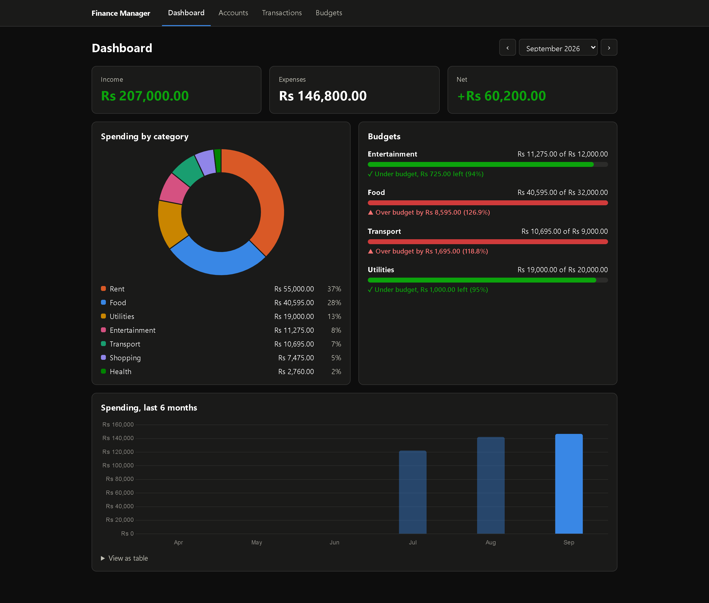
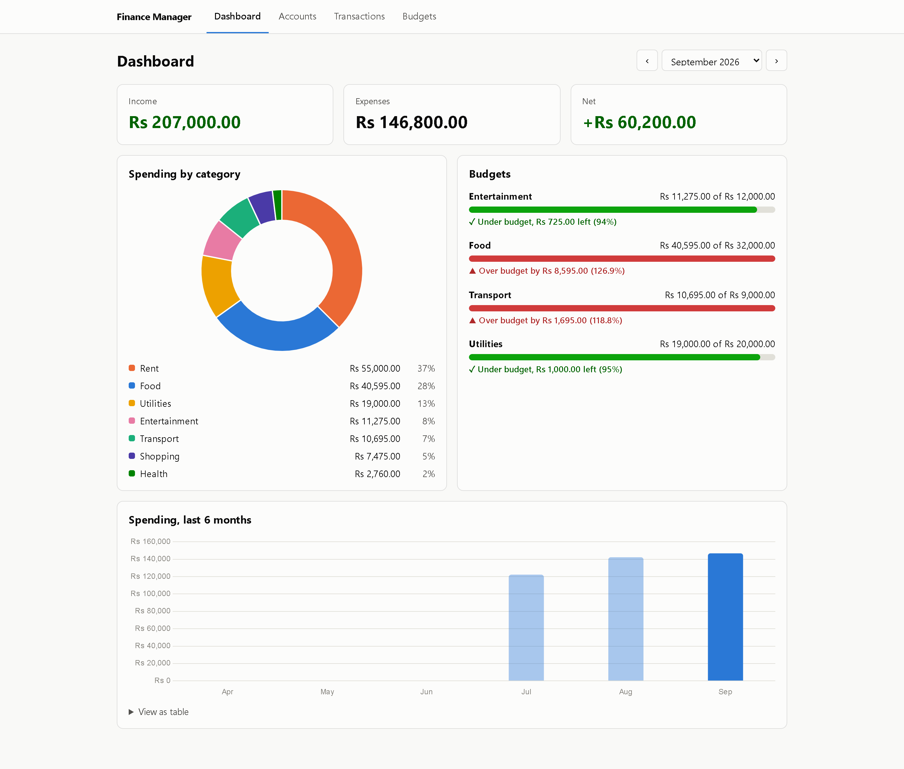
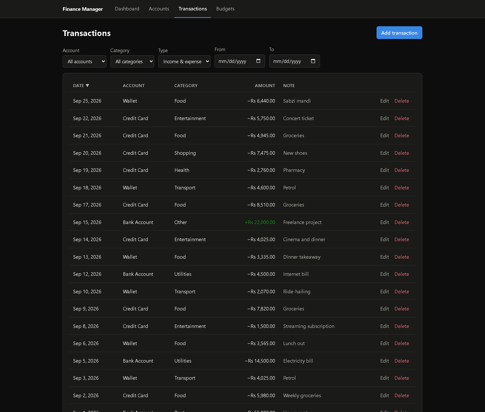
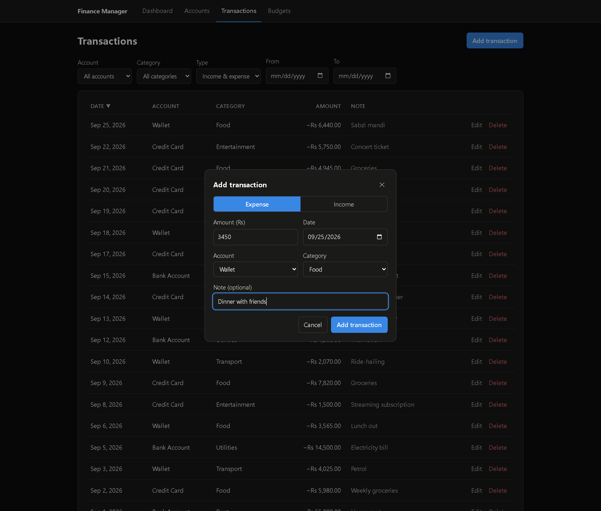
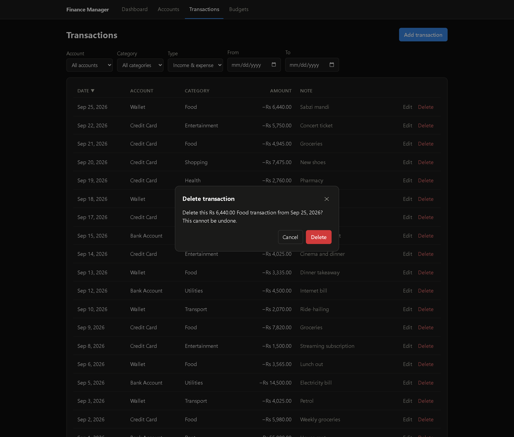
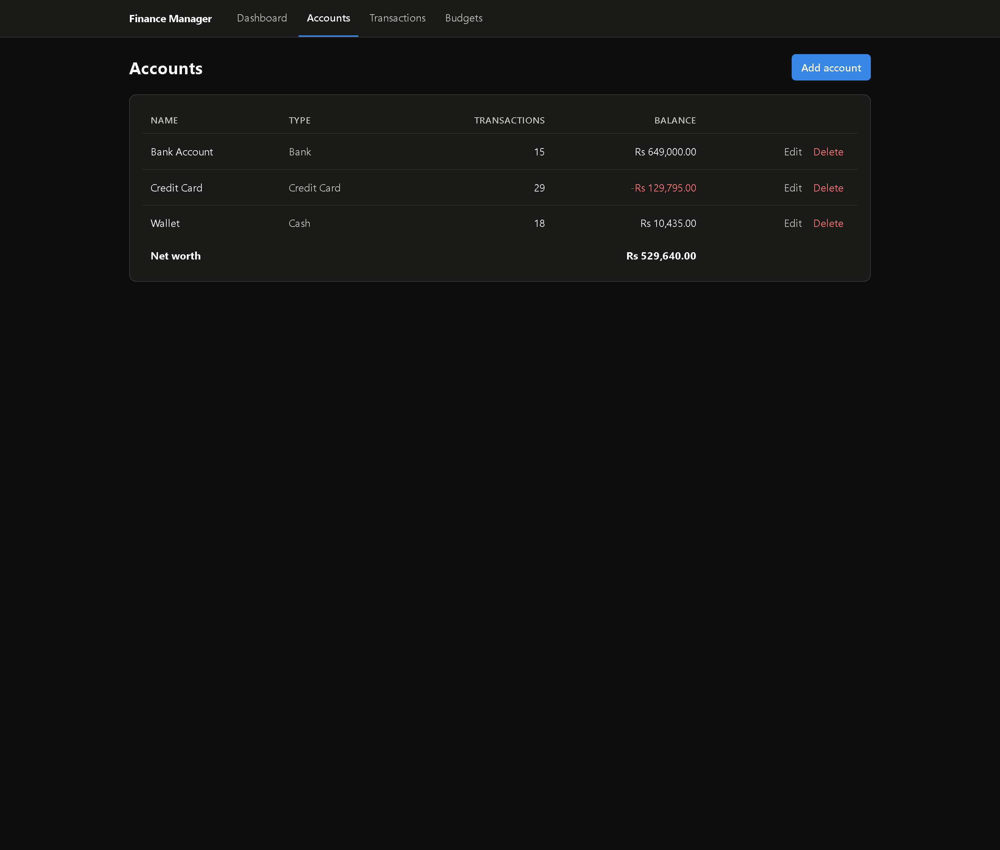
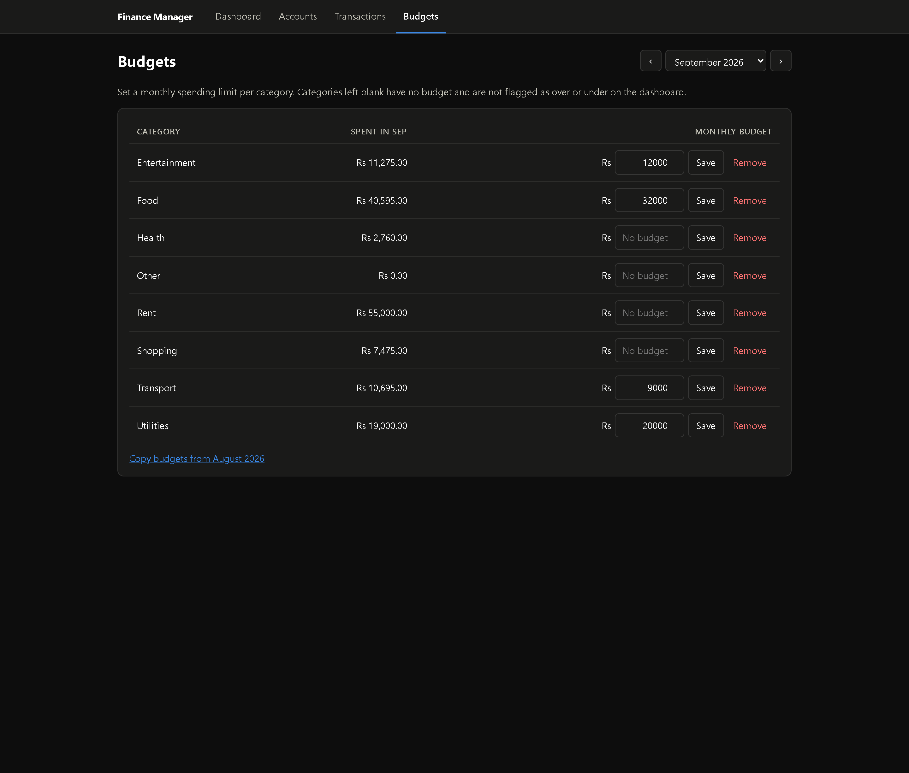
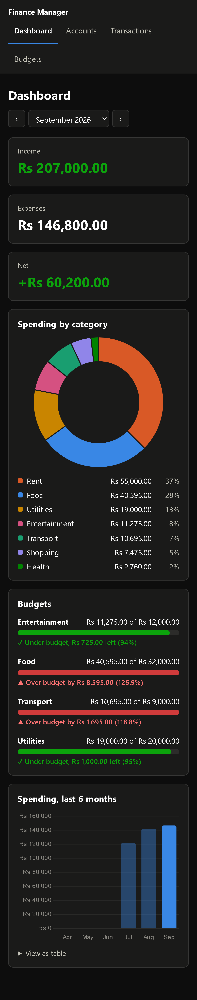

# Personal Finance Manager

A full-stack personal finance app that runs entirely on your own machine: no cloud services, no paid APIs, no separate database server.

- **Accounts**: Cash, Bank, Credit Card, or any custom type, each with a balance calculated from its transactions
- **Pakistani rupees (PKR)**: every amount is shown as `Rs 1,234.50`
- **Transactions**: add, edit and delete; filter by account, category, type and date range; sort by any column
- **Budgets**: a monthly budget per category; categories without a budget are never flagged
- **Dashboard**: income, expenses and net for any month, spending by category, budget progress (over/under), and a 6-month spending trend

## Screenshots

### Dashboard

Income, expenses and net for the selected month, spending by category, budget status flagged over or under, and a 6-month trend.



The same page in light mode. The theme follows your operating system.



### Transactions

Filter by account, category, type and date range, and sort by any column.



| Add or edit a transaction | Confirm before deleting |
| --- | --- |
|  |  |

### Accounts and budgets

| Accounts | Budgets |
| --- | --- |
|  |  |

### Mobile



## Tech stack

| Layer | Choice |
| --- | --- |
| Frontend | React 19, Vite, React Router, Chart.js via react-chartjs-2, plain CSS |
| Backend | Node.js, Express 5 (REST API) |
| Database | SQLite through `better-sqlite3` (a single file, no server) |

## Prerequisites

- Node.js 22.12 or newer
- npm

## Setup

```bash
npm run install:all
```

This installs the root, `server/` and `client/` dependencies.

## Run

Both servers in one terminal:

```bash
npm run dev
```

Or in two terminals:

```bash
npm run dev:server
```

```bash
npm run dev:client
```

Then open http://localhost:5173. The API runs on port 5000, and Vite proxies every `/api` request to it.

On the very first start the database file `server/data/finance.db` is created and filled with sample accounts, categories, budgets and three months of transactions.

## Reset the database

Rebuild the database with the sample data:

```bash
npm run reset
```

Rebuild it with only the starter categories (a blank slate):

```bash
npm run reset:empty
```

Both work while the server is running. To start over completely, stop the server and delete the `server/data` folder; the next start recreates and re-seeds it. Set `SEED=false` to skip the sample data on that first start.

## Tests

```bash
npm test
```

This runs both suites; use `npm run test:server` or `npm run test:client` to run one.

**Server (85 tests, Node's built-in test runner).** Unit tests for the money and date helpers, the request validators, the error handler, and the database layer (schema, constraints, seed data); plus API tests against an in-memory database covering balance updates, validation, filtering and sorting, budget rules, report calculations, and regressions for fixed bugs.

**Client (111 tests, Vitest with Testing Library).** Unit tests for the formatters, API client, category color assignment and the `useApi` hook (including out-of-order responses), component tests for the forms, modal and month selector, and page tests for the Dashboard, Accounts, Transactions and Budgets pages with the API mocked.

## Project structure

```
finance-manager/
├── package.json            root scripts (dev, reset, test)
├── server/
│   └── src/
│       ├── index.js        starts the server, seeds a brand-new database
│       ├── app.js          builds the Express app (kept separate for testing)
│       ├── db/             connection, schema.sql, seed.js, reset.js
│       ├── routes/         HTTP layer: parse and validate, call a service, respond
│       ├── services/       business logic and SQL
│       ├── middleware/     validators and the central error handler
│       └── utils/          money and date helpers
│   └── test/               API tests
└── client/
    └── src/
        ├── api/            one fetch wrapper per endpoint
        ├── hooks/          useApi (data loading), useChartTheme (chart colors)
        ├── pages/          Dashboard, Accounts, Transactions, Budgets
        ├── components/     forms, modal, month selector, charts
        └── styles/         app.css (light and dark theme)
```

## Data model

```
accounts      id, name (unique), type, opening_balance_cents, created_at
categories    id, name (unique), kind (income | expense | both)
transactions  id, account_id, category_id, amount_cents, type, date, note, created_at
budgets       id, category_id, month (YYYY-MM), amount_cents, UNIQUE(category_id, month)
```

## API

| Method | Endpoint | Notes |
| --- | --- | --- |
| GET, POST | `/api/accounts` | list with balances, create |
| GET, PUT, DELETE | `/api/accounts/:id` | delete returns 409 if the account has transactions, unless `?cascade=true` |
| GET, POST | `/api/categories` | |
| PUT, DELETE | `/api/categories/:id` | delete returns 409 if the category is in use |
| GET, POST | `/api/transactions` | GET filters: `accountId`, `categoryId`, `type`, `from`, `to`, `sort`, `order` |
| GET, PUT, DELETE | `/api/transactions/:id` | |
| GET, POST | `/api/budgets` | GET takes `?month=YYYY-MM` |
| PUT, DELETE | `/api/budgets/:id` | PUT changes the amount |
| GET | `/api/reports/summary?month=YYYY-MM` | totals, spending by category, budget status |
| GET | `/api/reports/trend?end=YYYY-MM&months=6` | total spending per month, oldest first |

Amounts are in Pakistani rupees (PKR) in the API. Errors are always JSON: `{ "error": "message" }`.

## Design decisions

**Layered backend.** Routes only handle HTTP (parse, validate, respond). Services own the SQL and business rules. The database module owns the connection. Each layer can be read, tested and changed on its own.

**Money is stored as integers in the smallest unit (paisa; the columns are named `*_cents`).** Floating point cannot represent values like 0.1 exactly, so sums drift. Integers are exact; conversion to and from rupees happens only at the API edge (`utils/money.js`), and there is a test that adds 0.1 and 0.2.

**Balances are derived, never stored.** An account balance is its opening balance plus income minus expenses, computed in SQL. Adding, editing or deleting a transaction therefore updates the balance automatically, and it can never go out of sync. The trade-off is a small aggregate query per read, which is negligible at personal-finance scale.

**Constraints live in the database as well as in code.** `CHECK` constraints, `UNIQUE (category_id, month)` and foreign keys keep the data valid even if a bug slips past the API. Foreign keys are switched on explicitly because SQLite ignores them by default.

**Safe deletes.** Foreign keys use `ON DELETE RESTRICT` for transactions, so deleting an account or category that is still in use is refused with a 409. Deleting an account can cascade to its transactions only when the client asks for it explicitly.

**"No budget" is the absence of a row.** A missing budget row means the category is not tracked, so the dashboard never shows over or under for it. Budgets are unique per category and month, so setting one is a create or an update.

**Filtering and sorting run in SQL.** The client passes filters and a sort key; the server whitelists sortable columns because column names cannot be bound as parameters and interpolating user input into `ORDER BY` would allow SQL injection.

**Month ranges use string comparison.** Dates are stored as `YYYY-MM-DD`, which sorts correctly as text, so `date BETWEEN '2026-09-01' AND '2026-09-31'` selects a month and can use the date index.

**Schema versioning without a migrations library.** SQLite's `user_version` pragma records the schema version. A new database is created in one transaction (schema plus starter categories or nothing).

**Reset works on a running server.** `npm run reset` drops and recreates the tables in place instead of deleting the file, because Windows will not delete a file another process has open. SQLite runs in WAL mode so the reset script can write while the server is connected.

**Frontend.** State stays local to each page with a small `useApi` hook that tracks loading and error state and ignores responses from outdated requests. The Vite dev server proxies `/api`, so the client uses relative URLs and needs no CORS setup.

**Accessible charts and colors.** Categories keep the same color everywhere (color follows the category, not its rank), from a colorblind-tested palette; past eight categories extras share a neutral gray. Budget status is shown with an icon and words as well as red and green, income and expense amounts carry a sign, and the charts have table alternatives (the legend and a "View as table" section). Light and dark themes follow the operating system.

## Notes

- `better-sqlite3` is pinned to 12.x. Its 13.x prebuilt binary crashed on Node 22.12 for Windows during development.
- In Windows PowerShell, `npm run reset -- --empty` loses the flag, which is why there is a separate `reset:empty` script.

## Ideas for next steps

- Transfers between accounts
- CSV import and export
- Editing categories from the UI (the API already supports it)
- Recurring transactions
